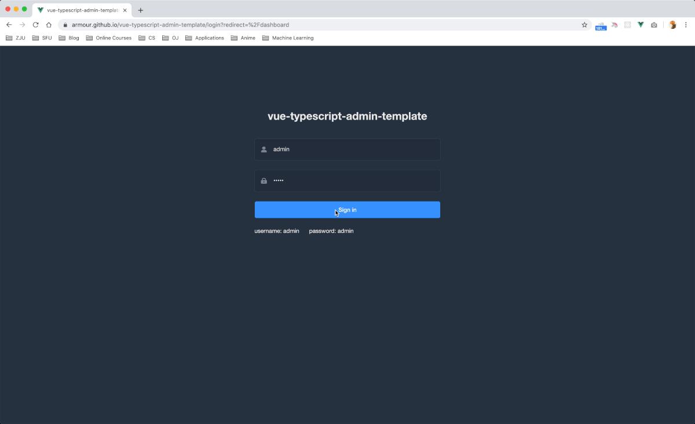

# vue-typescript-admin-template

[](http://makeapullrequest.com)
[](https://circleci.com/gh/Armour/vue-typescript-admin-template/tree/minimal)
[](https://opensource.org/licenses/MIT)
[](https://github.com/Armour/Jarvis)

[English](./README.md) | 简体中文

## 总览

这是一个极简的 vue typescript admin 管理后台。它只包含了 Element UI & axios & svgicon & permission control & lint，这些搭建后台必要的东西。部分源代码是由 [vue-cli](https://github.com/vuejs/vue-cli) 和 [jarvis](https://github.com/Armour/Jarvis) 自动生成的。Mock 部分直接使用了我预先搭建的 [Mock 服务器](https://github.com/armour/vue-typescript-admin-mock-server)。

## 截图/动图



## 相关项目

[Armour/vue-typescript-admin-mock-server](https://github.com/armour/vue-typescript-admin-mock-server) (Mock 服务器)

[Armour/vue-typescript-admin-docs](https://github.com/armour/vue-typescript-admin-docs) (项目文档)

Javascript 版本相关:

[PanJiaChen/vue-admin-template](https://github.com/PanJiaChen/vue-admin-template) (a vue2.0 minimal admin template)

[PanJiaChen/vue-element-admin](https://github.com/PanJiaChen/vue-element-admin) (full features supported vue admin)

[PanJiaChen/electron-vue-admin](https://github.com/PanJiaChen/electron-vue-admin) (a vue electron admin project)

## 如何设置以及启动项目

### 安装依赖

```bash
yarn install
```

### 启动本地开发环境（自带热启动）

```bash
yarn serve
```

### 构建生产环境 (自带压缩)

```bash
yarn build
```

### 代码格式检查以及自动修复

```bash
yarn lint
```

### 运行单元测试

```bash
yarn test:unit
```

### 自动生成 svg 组件

```bash
yarn svg
```

### 自定义 Vue 配置

看这里 [Configuration Reference](https://cli.vuejs.org/config/).

## 浏览器支持

Modern browsers and Internet Explorer 10+.

| [](http://godban.github.io/browsers-support-badges/)</br>IE / Edge | [](http://godban.github.io/browsers-support-badges/)</br>Firefox | [](http://godban.github.io/browsers-support-badges/)</br>Chrome | [](http://godban.github.io/browsers-support-badges/)</br>Safari |
| --------------------------------------------------------------------------------------------------------------------------------------------------------------------------------------------------------------- | ----------------------------------------------------------------------------------------------------------------------------------------------------------------------------------------------------------------- | ------------------------------------------------------------------------------------------------------------------------------------------------------------------------------------------------------------- | ------------------------------------------------------------------------------------------------------------------------------------------------------------------------------------------------------------- |
| IE10, IE11, Edge                                                                                                                                                                                                | last 2 versions                                                                                                                                                                                                   | last 2 versions                                                                                                                                                                                               | last 2 versions                                                                                                                                                                                               |

## 参与贡献

请看 [CONTRIBUTING.md](https://github.com/Armour/vue-typescript-admin-template/blob/master/.github/CONTRIBUTING.md)

## License

[MIT License](https://github.com/Armour/vue-typescript-admin-template/blob/master/LICENSE)
