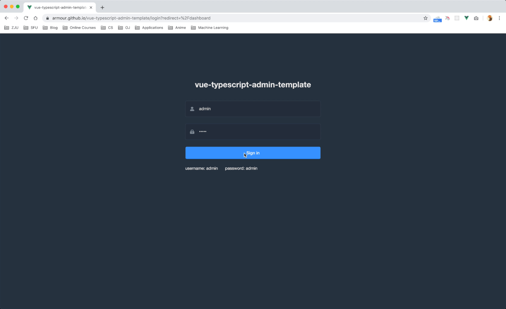

# vue-typescript-admin-template

[](http://makeapullrequest.com)
[](https://circleci.com/gh/Armour/vue-typescript-admin-template/tree/minimal)
[](https://opensource.org/licenses/MIT)
[](https://github.com/Armour/Jarvis)

English | [简体中文](./README-zh.md)

## Overview

A minimal vue typescript admin template with element-ui & axios & svgicon & permission control & lint, part of the code was generated by [vue-cli](https://github.com/vuejs/vue-cli) and [jarvis](https://github.com/Armour/Jarvis). The mock data part is using a [mock server](https://github.com/armour/vue-typescript-admin-mock-server) that I previously set up.

## Screenshots



## Related Project

[Armour/vue-typescript-admin-mock-server](https://github.com/armour/vue-typescript-admin-mock-server) (mock server)

[Armour/vue-typescript-admin-docs](https://github.com/armour/vue-typescript-admin-docs) (documentation source)

Javascript version:

[PanJiaChen/vue-admin-template](https://github.com/PanJiaChen/vue-admin-template) (a vue2.0 minimal admin template)

[PanJiaChen/vue-element-admin](https://github.com/PanJiaChen/vue-element-admin) (full features supported vue admin)

[PanJiaChen/electron-vue-admin](https://github.com/PanJiaChen/electron-vue-admin) (a vue electron admin project)

## Project setup

```bash
yarn install
```

### Compiles and hot-reloads for development

```bash
yarn serve
```

### Compiles and minifies for production

```bash
yarn build
```

### Lints and fixes files

```bash
yarn lint
```

### Run your unit tests

```bash
yarn test:unit
```

### Generate all svg components

```bash
yarn svg
```

### Customize Vue configuration

See [Configuration Reference](https://cli.vuejs.org/config/).

## Browsers support

Modern browsers and Internet Explorer 10+.

| [](http://godban.github.io/browsers-support-badges/)</br>IE / Edge | [](http://godban.github.io/browsers-support-badges/)</br>Firefox | [](http://godban.github.io/browsers-support-badges/)</br>Chrome | [](http://godban.github.io/browsers-support-badges/)</br>Safari |
| --------------------------------------------------------------------------------------------------------------------------------------------------------------------------------------------------------------- | ----------------------------------------------------------------------------------------------------------------------------------------------------------------------------------------------------------------- | ------------------------------------------------------------------------------------------------------------------------------------------------------------------------------------------------------------- | ------------------------------------------------------------------------------------------------------------------------------------------------------------------------------------------------------------- |
| IE10, IE11, Edge                                                                                                                                                                                                | last 2 versions                                                                                                                                                                                                   | last 2 versions                                                                                                                                                                                               | last 2 versions                                                                                                                                                                                               |

## Contributing

See [CONTRIBUTING.md](https://github.com/Armour/vue-typescript-admin-template/blob/master/.github/CONTRIBUTING.md)

## License

[MIT License](https://github.com/Armour/vue-typescript-admin-template/blob/master/LICENSE)
